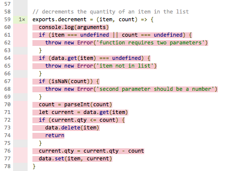

# Writing Robust Code

In this worksheet you will be introduced to the tools and techniques you will need to successfully complete your work. If you learn and apply these to your assignment you will increase your chances of gaining a much higher grade.

The lab materials are frequently updated to fix bugs and improve your experiences. Before starting any lab you should use the Terminal to navigate to your local repository directory pull any updates from the _upstream remote_.
```
cd 305CDE
git pull upstream
```

## 1 Using a Linter

A **linter** is a program that checks your source code for _programmatic_ and _stylistic_ errors. This will help you to identifying many of the common mistakes that can occur when writing JavaScript code and will ensure the style of your code is consistent.

This is especially important when programming in _JavaScript_ because there are many different programming styles and techniques, many of which can lead to tricky bugs. For this reason there are many different linters that are designed for _JavaScript_, in this module you will learn about one of the more powerful and configurable, called **ESLint**.

EsLint is highly configurable through a hidden config file that needs to be added to the project root directory.

### 1.1 The ESLint Configuration File

Start by ensuring hidden files are displayed in the _Workspace Sidebar_ by clicking on the _gear icon_ and making sure the **Show hidden files** option is checked.


Near the bottom of the file list you should see a file called `.eslintrc`, the initial dot (.) in the filename caused it to be hidden by default.

1. Notice that the file contents are using the _JSON_ format which should be familiar to you.
2. There are two JSON objects, **env** and **rules**.
  1. The **env** object describes the _environment_ you are using. In our example we indicate that we will be using the ECMA6 syntax, are writing _NodeJS_ code, and will be using _Jasmine_ tests.
  2. The **rules** object defines the rules we want to apply. As you can see we are requiring tab indentation, single quotes and avoiding the use of semicolons on each line. The full list of rules can be found in the [ESLint Documentation](http://eslint.org/docs/rules/).
  3. Each rule has a reporting level where 0 means _disabled_, 1 means _warning_ and 2 means _error_. This affects how the rule violations are reported.
  4. Some rules allow for additional options. If these are specified, both the reporting level and options need to be in an array.

### 1.2 ESLint Integration into Cloud9

Cloud9 has support for ESLint embedded in the code editor. Open the `index.js` file and notice the error and warning symbols down the left gutter to the left of the line numbers. If you hover over them you get a description of the problem.

Many ESLint errors relate to whitespace and to identify and fix these it can be useful to show the whitespace characters (spaces, tabs and newlines) in the editor. To enable this in Cloud9:
1. choose **Preferences** from the **Cloud9** menu in the top-left corner.
2. Click on **User Settings** and locate the **Code Editor (Ace)** option within the **Editors** section.
3. Finally enable 'Show Invisible Characters' and close the options panel.

You should now be able to see these in the editor.

#### 1.2.1 Test Your Knowledge

Open the `index.js` file and fix all the _whitespace_ and _indentation_ issues.

### 1.3 Running ESLint From the Terminal

ESLint is available as a NodeJS package which allows you to run it from the terminal. Since there is already support built-in, why would you want to do this?
1. Some editors don't have ESLint support.
2. Running ESLint in the Terminal gives a summary of the linting errors.to check if _all the scripts_ are fixed.
3. It can be configured to fix many of the most common error such as whitespace and semicolon usage.
4. The linting can be run as part of the _Continous Integration_ and _Continous Deployment_ process (more on this in a later worksheet)
5. Finally, it will be used during the marking of your assignment to make sure your code is formatted correctly!

#### 1.3.1 Test Your Knowledge

lets install, configure and run the console-based linter.

1. Start by opening a terminal window and navigating to the `shopping/` directory.
2. Install the NodeJS ESLint package `npm install eslint --save-dev`. This installs it and adds it to your `package.json` file in the `devDependencies` section.
3. Run the executable `node_modules/.bin/eslint .`. This runs the `eslint` executable located in the hidden `.bin/` directory in the `node_modules/` directory.
4. You will see a list of all the errors and warnings found together with a summary with the total number of errors and the total number of warnings.
5. Now run the same command but this time pass the `fix` flag, `node_modules/.bin/eslint --fix .`
6. Open the `index.js` file and notice that most of the issues have gone. The fix tool is not perfect, it may have introduced new errors so use it with caution!

## 2 Project Metadata

Applications written in NodeJS typically contain a file called `package.json` which contains the _metadata_ associated with the project. This includes:

- information about the project such as name, description, keywords and author
- information about the remote repository where the project is hosted
- any modules needed for the project to run (dependencies)
- any modules needed to support development (devDependencies)
- aliases to any useful commands and scripts (scripts)

When you create a new project you should run the `npm init` command to run a wizard. This will build a skeleton `package.json` file for you.

### 2.1 Adding Third-Party Modules

You are already familiar with the process of importing modules into your projects however if you are using a metadata file you need to make sure any modules you import are listed. This is achieved by using _flags_.

- To add a module to the `dependencies` list you need to use the `--save` flag. For example to import the _request_ module and add a reference into your `package.json` file you would run `npm install request --save`.
- To add a module to the `devDependencies` list you use the --save-dev flag instead.

Open the `package.json` file and read it carefully.

1. the `scripts` section defines four script shortcuts
2. the `dependencies` section defines the same dependencies as were used in the previous lab
3. the `dev-dependencies` section defines any dependencies required as part of the _development process_

Now install all the dependencies using `npm install`.

### 2.2 Test Your Knowledge

1. modify the `package.json` file and change the version to 1.0.1
2. install the **request** module, making sure it is referenced in the `dependencies` object in your `package.json` file.
3. install the **forever** module, making sure it is referenced in the `devDependencies` object.

## 3 Writing Modular Code

Building robust code is vitally important which means it should be frequently tested against the agreed spec. You will have already been shown the principles of Test-Driven Development (TDD) in the module 205CDE but in this module you will be taking your skills to an entirely new level and building the process into everything you do.

Open the `shopping/` directory and examine the files and directory structure.
```
.
├── debug.js
├── index.js
├── modules
│   └── shopping.js
├── node_modules
├── package.json
└── spec
    └── shopping-spec.js
```
Notice that there is a `modules/` directory. Unit testing is carried out on _units_ of code. In NodeJS we capture functionality in **modules** and these are what we will run the tests on. Each module should be self-contained. _All_ the application _business logic_ should be moved into modules.

### 3.1 NodeJS Modules

Open the `modules/shopping.js` script and read it carefully.

1. Notice that the module imports its own dependencies which will not be visible to other scripts (node-persist in this case).
2. The `exports` object contains the public-facing functionality
  - each object stores an anonymous function which can be called by other parts of our app.
  - each anonymous function is defined using the [ECMA6 Arrow Function](https://developer.mozilla.org/en/docs/Web/JavaScript/Reference/Functions/Arrow_functions) syntax
  - the functions in some of the properties (count, clear, getAll) take no parameters (indicated by a pair of empty brackets in front of the `=>` arrow)
  - the other functions take a single parameter, listed before the `=>` arrow
3. Some functionality has been completed but there are some [stub functions](https://en.wikipedia.org/wiki/Method_stub) which represent functionality we have not yet implemented.

Next open the `debug.js` script and study it carefully.

1. Notice that it _imports_ our **shopping** module into an _immutable variable_
  - the relative path needs to be included (its in the `modules` directory)
  - the file extension does not need to be included
2. Any functions in our module that are _exported_ can be accessed through the immutable variable.

There is a shortcut defined to run this script, run it now and see what happens.
```
npm run debug
```

### 3.2 Test Your Knowledge

1. Open the `debug.js` script and place a breakpoint on the line `list.add('cheese')`.
2. Use the **Run** button to run the script and open the debugger tools when the script stops on the breakpoint.
3. Add `data` to the _Watch Expressions_.
4. Single-step through the code.
  - start by using the _Step Into_ button to step into the module code
  - once in the module use _Step Over_ to run each line
  - as you step through watch the program flow and contents of the local variables

## 4 Unit Testing

_Unit testing_ is a vital skill if you are planning a career in software development. It is also a key part of your module assessment. In this exercise you will be using a framework called [Jasmine](http://jasmine.github.io/2.0/introduction.html). In this exercise you will learn how to run tests.

1. Open the necessary windows:
  - split the main screen into two panels (View > Layout > Horizontal Split)
  - open the `shopping.js` script in the left panel, this is the module we are testing.
  - open the `spec/shopping-spec.js` script in the right panel. This is the _test suite_ containing the tests we are running
  - open a terminal window at the bottom of the screen and run the tests `npm test`.
2. Carefully read the test file:
  - notice that we import the module we are testing, specifying the relative path
  - the **test suite** is defined using the `describe()` function, it takes two parameters, the description and an anonymous function containing the _specs_
  - each **spec** is defined in either an `it()` or `xit()` function. By placing an `x` in the function name the spec is set as _pending_ which means it won't run.
  - each spec contains tests, called **expectations** that are used to check the state of the code.
  - the `beforeEach()` function is executed before each spec is run (once per spec) and is used to configure a known environment
  - the `afterEach()` function runs after each spec finishes and is used to tidy up before the next spec is run.
3. Launch the Test Runner
  - in the open terminal window use the Jasmine-Node **Test Runner** to automatically run your test suite. There is already a shortcut configured in the `package.json` file so use `npm test`.
  - you will see the tests in the test suite run successfully.
  - remove the pending status from the 'should throw an error if item not in list' spec. Notice that as soon as you save the changes the tests run automatically.
  - notice that this spec _fails_.

### 4.1 Test Your Knowledge

1. Implement the `getItem()` function in `shopping.js` so that the new test passes (you will need to use the `get()` method that forms part of the [Map](https://developer.mozilla.org/en/docs/Web/JavaScript/Reference/Global_Objects/Map) prototype)
2. Uncomment the next spec (should throw an error if item not in list) and modify the `getItem()` function in `shopping.js`. You will need to correctly implement _exception handling_ which was covered in the previous lab.
3. Uncomment the next spec (should delete first item) and implement the `removeItem()` function in `shopping.js`. You will need to use the `Map.delete()` method.
4. Uncomment the next spec (should delete last item) and make sure the tests pass.
5. Finally Uncomment the last spec (should throw error if item not in list) and implement error handling so that the test passes.

## 5 Code Coverage

If we are going to rely on our automated tests to guarantee our code runs as expected we need to check that these tests are _comprehensive_. There are two aspects we need to check:

1. Can our script handle both _good_ and _bad_ data.
  - bad data might include missing parameters as well as invalid data types or values (trying to access an array index that doesn't exist for example)
2. Do the automated tests test _every line of our code_ including all conditional branches.
  - this is called code coverage and there are automated tools to help us with this.

### 5.1 Running the Code Coverage Test

Start by installing the node **Istanbul** module has already been installed so we can run our coverage tests. Note that any command-line tools installed by a package can be found in the `node_modules/.bin` directory.
```
./node_modules/.bin/istanbul cover -x **spec/** -x **index.js** -x **debug.js** jasmine-node spec
```
There are a number of important parameters and flags so lets analyse these:

1. the command we use is called `istanbul` which was installed using the command on the previous line.
2. to generate a complete coverage report we need to pass the `cover` parameter.
3. There are some files we don't want to check for code coverage:
  - the `spec/` directory contains our tests and we won't be writing tests for our tests!
  - the `index.js` file is used to run our app interactively, its not part of the application logic model.
  - the `debug.js` script serves a similar purpose.
4. Finally we specify the command to run the unit tests.

The parameters and flags won't change between runs so we should create an _alias_ to make it easier to trigger the coverage suite. These are stored in the `package.json` file under the `scripts` key. If you open this you will see that there is an alias called `coverage`, so to run our coverage suite we call.
```
npm run coverage
  =============================== Coverage summary =============================
  Statements   : 65.85% ( 27/41 )
  Branches     : 37.5% ( 6/16 )
  Functions    : 100% ( 0/0 )
  Lines        : 65.85% ( 27/41 )
  ==============================================================================
```

### 5.2 Analysing the Code Coverage Report

When the coverage test has finished it generates a report in a `coverage/` directory.
```
.
├── coverage.json
├── lcov-report
│   ├── base.css
│   ├── index.html  < this is the file you need to open...
│   ├── modules
│   ├── prettify.css
│   ├── prettify.js
│   ├── shopping
│   ├── sort-arrow-sprite.png
│   └── sorter.js
└── lcov.info
```
1. Open the `index.html` file (as shown above), then click on the **Run** button at the top of the screen (we need to be running the Apache web server to view our report).
2. Right-click on the index.html file and choose **Preview**. You will see a code coverage summary screen where you will immediately spot we have very poor coverage with only 27 out of 41 lines of code being tested!

3. Click on the `modules/` link and drill down to the `shopping.js` file to see details which appear down the left margin.
  - any line of code that is being tested appears in green (the number represents the number of times it was called in the test suite)
  - any line in red has never been called by the test suite and so has not been tested.


### 5.3 Test Your Knowledge

It is immediately clear from the coverage report that there is a large chunk of code that is not being tested! If we are not testing code we have no confidence that it is working. The detailed report flags up the `decrement()` function.

1. Write unit tests to test that the `decrement()` function works correctly.
  - Make sure you test all code paths.
2. Periodically re-run the coverage tool and refresh the report page.
3. You are aiming for 100% code coverage.

## 6 Documentation

Whenever we write a program it is important that it is fully documented. A simple solution is to add comments to the code which can then be read by anyone who opens the script. A better solution would be to write up detailed _human readable_ documentation.

So what should we be documenting?

1. all function signatures (names, purpose, parameter, return types)
2. any exceptions that may be thrown.
3. an explanation of the purpose of any obscure lines of code

In this exercise you will learn how to use JSDoc to create detailed professional documentation for your code. JSDoc is a markup language used to annotate JavaScript source code files. Using comments containing JSDoc, you can add documentation describing the application programming interface of your code.

JSDoc is available as a NodeJS plugin. It has already been added as a _Dev Dependency_ in the `package.json` file and so it should already be installed. Lets use it to build the documentation for our modules.
```
node_modules/.bin/jsdoc modules/
```
This will create an `out/` directory containing the complete documentation as a website.
```
.
├── fonts
├── index.html  < this is the documentation home page...
├── module-shopping.html
├── scripts
├── shopping.js.html
└── styles
```
Right-click on the `index.html` file and choose _preview_. This will open the home page. The module list can be found down the right-hand side of the screen. Locate the **shopping** link and click to see the full documentation.

1. Notice that each variable and method definition has been lifted from the source code.
2. Notice that each method has a _description_, this was added to the source code file using the special JSDoc markers `/** */`.
3. The `getItem()` method documentation includes a lot more detail, this is defined in _block tags_:
  - a list of the parameters and their types
  - an explanation of the return value and type
  - a list of any exceptions that could be thrown

There are a lot more features that can be added to this, you should take time to read the full [documentation](http://usejsdoc.org) to find out what _block tags_ can be used.

### 6.1 Test Your Knowledge

1. Your challenge is to complete the documentation for the `shopping.js` module. You should use the `getItem()` documentation as a guide.
2. The _Linter_ tool (see section 1) will help you identify where you need to add additional JSDoc comments.
3. To check your results, run the documentation tool and reload the documentation web page.
4. Carefully read through the generated documentation to ensure it is both complete and makes sense.
