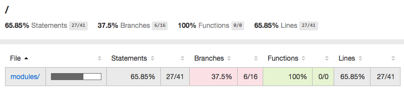

# Automated Testing

In the previous lab you learned about a range of tools and techniques to help you write robust code, in this lab you will learn about the most important tool to improve your productivity.

In this worksheet you will be introduced to the principles behind test-driven development (TDD) and shown how to automate the testing of both your overall API and the individual modules it contains.

You will be expected to demonstrate these skills in your assignment, marks will be awarded, so ensure you make use of TDD if you want to get a good grade.

The lab materials are frequently updated to fix bugs and improve your experiences. Before starting any lab you should use the Terminal to navigate to your local repository directory pull any updates from the _upstream remote_.
```
cd 305CDE
git pull upstream
```

## 1 Unit Testing

_Unit testing_ is a vital skill if you are planning a career in software development. It is also a key part of your module assessment. In this exercise you will be using a framework called [Jasmine](http://jasmine.github.io/2.0/introduction.html). In this exercise you will learn how to run tests.
1. Install all required node modules using the `npm install` command. This will install all the modules listed in the `package.json` file.
2. Open the necessary windows:
  - split the main screen into two panels (View > Layout > Horizontal Split)
  - open the `shopping.js` script in the left panel, this is the module we are testing.
  - open the `spec/shopping-spec.js` script in the right panel. This is the _test suite_ containing the tests we are running
  - open a terminal window at the bottom of the screen and run the tests `npm test`.
3. Carefully read the test file:
  - notice that we import the module we are testing, specifying the relative path
  - the **test suite** is defined using the `describe()` function, it takes two parameters, the description and an anonymous function containing the _specs_
  - each **spec** is defined in either an `it()` or `xit()` function. By placing an `x` in the function name the spec is set as _pending_ which means it won't run.
  - each spec contains tests, called **expectations** that are used to check the state of the code.
  - the `beforeEach()` function is executed before each spec is run (once per spec) and is used to configure a known environment
  - the `afterEach()` function runs after each spec finishes and is used to tidy up before the next spec is run.
4. Launch the Test Runner
  - in the open terminal window use the Jasmine-Node **Test Runner** to automatically run your test suite. There is already a shortcut configured in the `package.json` file so use `npm test`.
  - you will see the tests in the test suite run successfully.
  - remove the pending status from the 'should throw an error if item not in list' spec. Notice that as soon as you save the changes the tests run automatically.
  - notice that this spec _fails_.

### 1.1 Test Your Knowledge

1. Implement the `getItem()` function in `shopping.js` so that the new test passes (you will need to use the `get()` method that forms part of the [Map](https://developer.mozilla.org/en/docs/Web/JavaScript/Reference/Global_Objects/Map) prototype)
2. Uncomment the next spec (should throw an error if item not in list) and modify the `getItem()` function in `shopping.js`. You will need to correctly implement _exception handling_ which was covered in the previous lab.
3. Uncomment the next spec (should delete first item) and implement the `removeItem()` function in `shopping.js`. You will need to use the `Map.delete()` method.
4. Uncomment the next spec (should delete last item) and make sure the tests pass.
5. Finally Uncomment the last spec (should throw error if item not in list) and implement error handling so that the test passes.

## 2 Code Coverage

If we are going to rely on our automated tests to guarantee our code runs as expected we need to check that these tests are _comprehensive_. There are two aspects we need to check:

1. Can our script handle both _good_ and _bad_ data.
  - bad data might include missing parameters as well as invalid data types or values (trying to access an array index that doesn't exist for example)
2. Do the automated tests test _every line of our code_ including all conditional branches.
  - this is called code coverage and there are automated tools to help us with this.

### 2.1 Running the Code Coverage Test

Start by installing the node **Istanbul** module has already been installed so we can run our coverage tests. Note that any command-line tools installed by a package can be found in the `node_modules/.bin` directory.
```
./node_modules/.bin/istanbul cover -x **spec/** -x **index.js** -x **debug.js** jasmine-node spec
```
There are a number of important parameters and flags so lets analyse these:

1. the command we use is called `istanbul` which was installed using the command on the previous line.
2. to generate a complete coverage report we need to pass the `cover` parameter.
3. There are some files we don't want to check for code coverage:
  - the `spec/` directory contains our tests and we won't be writing tests for our tests!
  - the `index.js` file is used to run our app interactively, its not part of the application logic model.
  - the `debug.js` script serves a similar purpose.
4. Finally we specify the command to run the unit tests.

The parameters and flags won't change between runs so we should create an _alias_ to make it easier to trigger the coverage suite. These are stored in the `package.json` file under the `scripts` key. If you open this you will see that there is an alias called `coverage`, so to run our coverage suite we call.
```
npm run coverage
  =============================== Coverage summary =============================
  Statements   : 65.85% ( 27/41 )
  Branches     : 37.5% ( 6/16 )
  Functions    : 100% ( 0/0 )
  Lines        : 65.85% ( 27/41 )
  ==============================================================================
```

### 2.2 Analysing the Code Coverage Report

When the coverage test has finished it generates a report in a `coverage/` directory.
```
.
├── coverage.json
├── lcov-report
│   ├── base.css
│   ├── index.html  < this is the file you need to open...
│   ├── modules
│   ├── prettify.css
│   ├── prettify.js
│   ├── shopping
│   ├── sort-arrow-sprite.png
│   └── sorter.js
└── lcov.info
```
1. Open the `index.html` file (as shown above), then click on the **Run** button at the top of the screen (we need to be running the Apache web server to view our report).
2. Right-click on the index.html file and choose **Preview**. You will see a code coverage summary screen where you will immediately spot we have very poor coverage with only 27 out of 41 lines of code being tested!

3. Click on the `modules/` link and drill down to the `shopping.js` file to see details which appear down the left margin.
  - any line of code that is being tested appears in green (the number represents the number of times it was called in the test suite)
  - any line in red has never been called by the test suite and so has not been tested.


### 2.3 Test Your Knowledge

It is immediately clear from the coverage report that there is a large chunk of code that is not being tested! If we are not testing code we have no confidence that it is working. The detailed report flags up the `decrement()` function.

1. Write unit tests to test that the `decrement()` function works correctly.
  - Make sure you test all code paths.
2. Periodically re-run the coverage tool and refresh the report page.
3. You are aiming for 100% code coverage.

## 3 Acceptance Testing

In addition to carrying out _unit tests_ you can run tests on the API _interface_. This allows you to write tests that define how your API should handle various calls and test it using both good and bad data. Typically you should write these tests when you define your API _interface_ and before you carry out any coding.

Acceptance testing will be carried out using the [frisby](https://www.npmjs.com/package/frisby) package which is built on the [jasmine-node](https://www.npmjs.com/package/jasmine-node) framework you have already used.

2. open the `shopping/test/todo-spec.js` script and read it, paying particular attention to the detailed comments.
3. start the API and check it is visible using Postman.
4. change the base urls to match your cloud9 API.
5. run the acceptance tests by entering `./node_modules/.bin/jasmine-node test/ --verbose`, this will output the test results to the terminal. Take a few moments to understand this output.
6. run the acceptance tests again. Why do they fail this time, use the error trace to find out what failed and why.

## 1.1 Test Your Knowledge

1. create a new test `DELETE /lists` and add it at the start of the test. Eventually this should clear all the lists in the API and return success, lists deleted.
2. run your tests, they should fail (we have not written the new API feature!
3. add the  `--autotest --watch .` flags when you run the test script (see the previous worksheet), this will automatically run your acceptance tests every time you save a file.
3. implement `DELETE /lists`. The tests will pass to indicate success.
