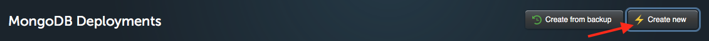
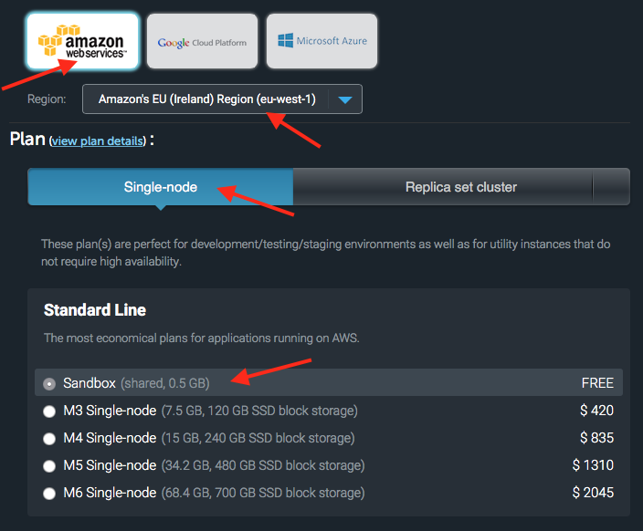
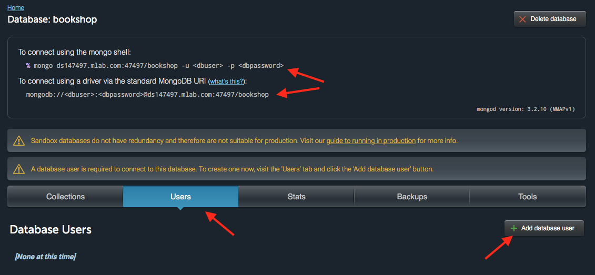

# Data Persistence

In this worksheet you will learn how to connect your code to a variety of different persistence frameworks. We will cover:

1. Saving to the filesystem using `node-persist`
2. Document databases (MongoDB)
3. Relational databases (MySQL)

In each of these cases you will be shown how to use NodeJS to carry out the basic **CRUD** operations, it is assumed that you already understand how to work with the databases.

In most cases, MongoDB Document databases are easier to integrate into your NodeJS code however if you prefer to use a relational database there are instructions at the end of this worksheet.

There is a slide deck https://goo.gl/izG1Xt to accompay this worksheet. Make sure you are familiar with its contents before proceeding.

## 1 The Filesystem

In the first example we will persist JavaScript objects by converting them to json strings and saving the string to a text file in a directory on the server. Node comes with a built-in module called `fs` which allows you to work directly with files however in this example we will be using a module called `node-persist` which abstracts this into a module.

Open the file `filesystem/storage.js` which contains an exported function to retrieve book details, extract some simple information and persist this to a file. At the top of the script we import `node-persist` and initialise it in _synchronous mode_ (it can also be use asynchronously via callbacks).

- The function takes two parameters:
  - a string containing the ISBN of the book to find.
  - a callback function.
- The first step is for a call to be made to the Google Books API.
  - If the returned array is empty we use the callback to pass an error.
  - If book data is returned, the title, subtitle, author and description are use to create a JavaScript object called `data`.
  - Finally the data is persisted using the `save()` method and returned in the callback.

Run the `index.js` script then look at the project files. Notice that there is a new (hidden) directory called `.node-persist/`. Inside this you will find a directory called `storage/` which contains a text file with our book data.
```
tree -a -L 3 -I node_modules
  .
  ├── .node-persist
  │   └── storage
  │       └── 7e9cf1f449d27f19b8a1869b0210dbe2     <- here is our data!
  ├── index.js
  ├── package.json
  └── storage.js
```
### 1.1 Test Your Knowledge

The sample code works but there are a number of missing features:

1. Extract and store the following additional data:
  1. The publisher
  2. The page count
2. Implement a function to remove a book with the specified ISBN number.
3. The data persistence is currently performed synchronously, modify the script to perform this asynchronously via a callback.

## 2 MongoDB

This is the most popular _document_ database. It's cross-platform and open source.

Rather than install MongoDB on your machine we will be hosting it on the [mlab](https://mlab.com) servers. You first step is to sign up for a free account. As part of this process you will be sent a confirmation email.

### 2.1 Installing MongoDB

You need to make sure you have a recent version of MongoDB installed. If you are on a linux computer (such as CodeAnywhere) you can perform the following steps:

1. Check the codename of the version of Ubuntu you have installed (this will be needed at a later step)
2. Use `apt-key` to add the mongodb authentication key. This flags the mongodb packages as trusted.
3. Add the correct MongoDB repository (note you need to insert the codename located in step 1 in the space indicated)
4. Download the package lists from the registered repositories
5. Install MongoDB
6. Check that you have installed a recent version of the Mongo Shell.
```
lsb_release -a
  No LSB modules are available.
  Distributor ID: Ubuntu
  Description:    Ubuntu 14.04.5 LTS
  Release:        14.04
  Codename:       trusty                  <-- Here is the CODENAME.
sudo apt-key adv --keyserver hkp://keyserver.ubuntu.com:80 --recv EA312927c
echo "deb http://repo.mongodb.org/apt/ubuntu CODENAME/mongodb-org/3.2 multiverse" | sudo tee /etc/apt/sources.list.d/mongodb-org-3.2.list
sudo apt-get update
sudo apt-get install mongodb-org  # accept all options when asked
mongo --version
MongoDB shell version: 3.2.10           <-- now we have mongo v3.2.x installed
```

### 2.2 Check Connectivity

Now we can create a new database on the mLab server and then use the Mongo Shell to connect to the database hosted on MLab. Start by loggin in and creating a new **MongoDB Deployment**



Next create a single Sandbox environment using an EU hosted AWS instance. Give your database the name **bookshop**.



Open the database and copy the two sets of connection details, paste them into a suitable file. Notice that we have two warnings. The first indicates that this database should not be used for production environments, we can ignore this. The second flags up that we have no database users. 

Click on the **Users** tab and then on the **Add Database User** button. Create a suitable account and make a note of the username and password.



Now we can try to connect to our database. Open the terminal in CodeAnywhere and paste in the mongo shell command you copied from the bookshop database screen, inserting your username and password where indicated.
```
mongo ds147497.mlab.com:47497/bookshop -u testuser -p password
  MongoDB shell version: 3.2.10
  connecting to: ds147497.mlab.com:47497/bookshop
  Welcome to the MongoDB shell.
  For interactive help, type "help".
  For more comprehensive documentation, see 
    http://docs.mongodb.org/
  Questions? Try the support group
    http://groups.google.com/group/mongodb-user
  rs-ds147497:PRIMARY>
```
Typing in the `exit` command will return you to the shell prompt.

### 2.3 Connecting from NodeJS

Now we have a hosted database and have confirmed we have connectivity its time to connect to it from our NodeJS script.

Open the `document/bookSchema.js` file.

- Notice that we load the `mongoose` package, this is the most popular way to connect NodeJS to MongoDB however there are other packages you might want to look at.
- The database login credentials are stored here:
  - The database username and password are stored in a `db` object, these will need replacing with your own login details.
  - To connect to the database using mongoose you need a connection string. This should be copied from the mLab database page.
  - The string is a template literal and you will need to insert the user and pass properties from your db object.
- A new Schema object is created called `bookSchema` which is passed to the `mongoose.model()` method to create a Book model.
- this is exported.

Open the `document/mongodb.js` file, this is where we will write the logic to work with Book Mongoose objects.

- We import our mongoose model.
- There is a single exported function which takes an **isbn** number and a callback function.
- There is a call to the Google Books API which returns details on the specified book.
- The data is extracted and stored in a JavaScript object.
- A new `Book` object ia created.
- The save method is called to persist the data.

Try running the script, this will insert a new document into the database each time you run it.

### 2.4 Querying using Mongo Shell

Lets log in using the `mongo` command as we did in step 3.2 so we can query the database.
```
use bookshop
db.books.find()
```
If you need to delete a collection completely you can use `drop()`
```
db.books.drop()
```

### 2.5 Test Your Knowledge

You have already worked with MongoDB in 220CT so here are some challenges to refresh your knowlege and skills:

1. Currently the same book can be added multiple times to the database. Modify the code so that an error is thrown and the book is not duplicated.
2. Modify the script so that the books stored in the database are formatted nicely when they are printed out.
3. Create a simple text-driven front end (like the one used in the todo exercise) so that the user can add books to their list and display a list of the books already added.

### Installing on MacOS

You will need to use [Homebrew](http://brew.sh) to install MongoDB on a Mac. Once this is installed:
```
brew update
brew install mongodb
```

## 3 MySQL

This is the most popular _relational_ database. It's cross-platform and open source.

Rather than install MySQL on your machine we will be hosting it on the [freeMySQLHosting](https://www.freemysqlhosting.net) servers. You first step is to sign up for a free account. As part of this process you will be sent a confirmation email. This can take a while to arrive.

Once you have received the confirmation link you will be able to create a new database, the details will be emailed to you. Once you have these details you can use the `mysql` command to try connecting to the server.
```
mysql -u sql8142511 -h sql8.freemysqlhosting.net -p sql8142511
```

Create a table called `books` with 4 columns.
```
Name        Type     Length   Index
-------------------------------------
id          INT      11       PRIMARY
title       VARCHAR  30
authors     VARCHAR  64
description TEXT
``` 
This can be created using the following SQL:
```
CREATE TABLE IF NOT EXISTS books ( 
  id INT(11) AUTO_INCREMENT PRIMARY KEY, 
  title VARCHAR(30), 
  authors VARCHAR(64), 
  description TEXT 
);
  Query OK, 0 rows affected (0.06 sec)
describe books;
  +-------------+-------------+------+-----+---------+----------------+
  | Field       | Type        | Null | Key | Default | Extra          |
  +-------------+-------------+------+-----+---------+----------------+
  | id          | int(11)     | NO   | PRI | NULL    | auto_increment |
  | title       | varchar(30) | YES  |     | NULL    |                |
  | authors     | varchar(64) | YES  |     | NULL    |                |
  | description | text        | YES  |     | NULL    |                |
  +-------------+-------------+------+-----+---------+----------------+
SELECT * FROM books;
  Empty set (0.04 sec)
```

open the `relational/` directory and study the `mysql.js` script.

Notice that it uses the [mysql](https://www.npmjs.com/package/mysql) module to connect to your hosted database but you will need to add your connection details at the top. These were emailed to you. Once you have added your details you should be able to run the `index.js` script which imports the module and tries to insert a valid then an invalid book based on the ISBN.

Now use the `mysql` command to connect to the database and retrieve all the data from the database, you should see your book in the table.

