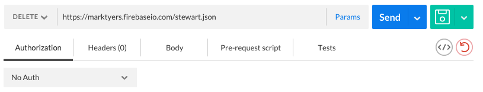

# JavaScript AJAX and DOM manipulation

## Introduction

Much of the functionality we see in modern web apps derives from online data sources called **Application Programming Interfaces (APIs)**. Later in this module you will be developing your own custom API however in this worksheet you will be creating a simplified version so that you can learn how to interact with it.

## 1 Creating a Simple API

We will be using an online tool called **FireBase** so your first task is to create an account and log on. Once you are logged on you can create a new API by entering a name and clicking on *create new app* (in this example I have used my name but you can choose anything you wish).


Once the app has been created you can click on the **Manage App** button to view its contents.

Now you can import a dataset by clicking on the **Import Data** button located in the top-right of the screen and choosing the `quotes.json` file located in the `08 AJAX/data` directory. This will import a base dataset to work with. You should now be able to browse the data in your API.


## 2 Interacting Using Chrome Postman

Before attempting to interact with an API using code you should always try out the requests using an interactive tool such as the **Postman** plugin for Google Chrome. If this is not currently installed you should do so now.

RESTful APIs provide interaction with online resources through the concepts of **resources** which are represented by *URLs* and **actions** which are represented by *HTTP methods*. We will look at how these can be combined.

### 2.1 GET

We will start by accessing existing resources using the GET method. The combination of url and method can be represented as shown. Note that the asimov node has been selected and we are requesting the response in *json* format. Remember to substitute your own database name in the url.

`GET https://databasename.firebaseio.com/asimov.json`

And here is how the request looks in Postman. Notice the GET method is selected at the left-hand side.


Check your understanding by working out what the following requests will return. Then try them out to see if you are correct.
```
GET https://marktyers.firebaseio.com/asimov/name.json
GET https://marktyers.firebaseio.com/asimov/quotes.json
GET https://marktyers.firebaseio.com/asimov/quotes/0.json
```

### 2.2 PUT

The **PUT** method is used to add a **named resource**. You need to specify the resource name in the URL and the resource itself in the *request body*. Lets walk through this process a step at a time. We will try adding another famous person to the API. You can find plenty of candidates in the `morequotes.json` file. We will add **George Boole**. The request details are shown below (note the quotes have been truncated to make it more readable in the worksheet).

```
PUT https://marktyers.firebaseio.com/boole.json
{
    "name": "George Boole",
    "born": "1815-11-02",
    "quotes": [
        "It is not of the essence of mathematics to be conversant...",
        "Probability is expectation founded upon partial knowledge...",
        "No matter how correct a mathematical theorem may appear to..."
    ]
}
```
And here is how this is entered into *Postman*. Notice that the method is set to **PUT**, and the json data is added to the request *body* as *raw* data in *JSON* format (see the four arrows).


### 2.3 POST

The **POST** method is used to add a new item to a collection. Collections are represented as arrays in our data. As you can see, the list of quotes forms a collection. Lets add  a new quote to the asimov/quotes collection.
```
POST https://marktyers.firebaseio.com/asimov/quotes.json
"Creationists make it sound as though a theory is something you dreamt up after being drunk all night."
```
And here is how the request is made in *Postman*. Notice the data is sent as **text** and enclosed in double-quotes.


We can issue a **GET** request to display the `asimov/quotes` collection to make sure the new quote has been added.

### 2.4 DELETE

The final HTTP method we will examine will be **DELETE**. This is used to remove resources and collections. We specify the resource to delete through its URL. Lets delete the document representing *Ian Stewart*.
```
DELETE https://marktyers.firebaseio.com/stewart.json
```
And this is how it looks in Postman.



## 3 XMLHttpRequest

By now we have a basic understanding of how to carry out CRUD operations on a RESTful API. In this section of the worksheet we will learn how to make HTTP requests from a JavaScript application.

In the previous examples the people collection was accessed directly off the domain root. Unfortunately this prevents us accessing the authors collection. Start by deleting the documents by clicking on the red cross next to the root node. Now import the data from `data/quotes2.json`. This will add a root `people` node as shown.


Open the file `08 AJAX/quotes.html` and its accompanying JavaScript file. Modify the base URL on line 3 of the JavaScript file to match your FireBase API.


## About

This week covers two big JS topics, so there are examples of each.

AJAX allows "on the fly" access to data from elsewhere (usually a remote server) by the browser client. Often the data passed around is in JSON format.

DOM manipulation by JS allows you to 'read', 'write', 'update', and 'delete' actual elements of the web page itself. In other words, you can use JS to modify the HTML presented to the user dynamically.

## Order of Labs

* DOM
	1. events.html
	2. map.html
	3. dom_scripting.html
* AJAX
	1. ajax_basic.html
	2. ajax_sync.html 

## Running the Code

The `data` directory contains the JSON data for this example. **IMPORTANT NOTE:** read below if you are not using a web server.

Due to browsers' security policies the code will fail if you are testing the page via a `file:\\` address in the browser, since [cross origin requests][cors] are only supported with `http(s):\\` and the relative URL supplied trips up the check.

In other words, to use the JSON files in the `data` directory you will need to serve the page from a web server and access the HTML files via `http(s):\\`.

#### Workaround

Swap in the suggested Github Gist URLs _found in the comments within the HTML_ files, which will allow direct access to the JSON files from the web.


[cors]: http://en.wikipedia.org/wiki/Cross-origin_resource_sharing

## AJAX with Closures

One common scenario is to encapsulate the AJAX calls within a closure. Because the AJAX calls are asyncronous the exported functions need to include a callback that gets triggered once the AJAX call has completed.

Open up the `weather.html` file and locate its associated JavaScript file that contains an *IIFE*. Locate the two calls to the IIFE (these are located in the html file), notice how the `setTown()` method takes two parameters, the name of the town and an anonymous callback function.

### Tasks

Open the `weather.html` file in your web browser and examine the *JavaScript Console*. Note both the data displayed and the order in which this occurs. Can you explain this? Why does one method return *undefined* and how could you fix this? Make sure your code runs before continuing.

Add a form to the html document to allow the user to enter a town. Display the town details in the web page. What happens if the user enters an unknown town? Can you modify the code to take this into account?

### Test Your Knowledge

1. Add two methods called `today()` and `tomorrow()`. These should return the weather for the appropriate days.
2. At the moment the data contains unnecessary information, and the useful information is not clearly identifiable. Create a private function that takes the data for a day and returns a tidied version. Apply this to the data returned in the first challenge.