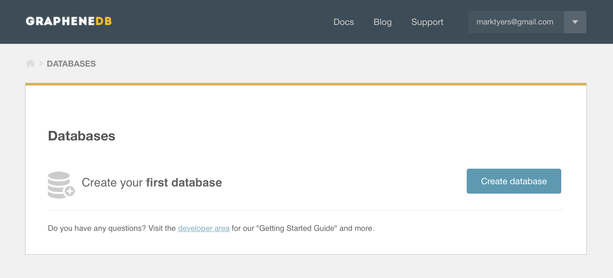
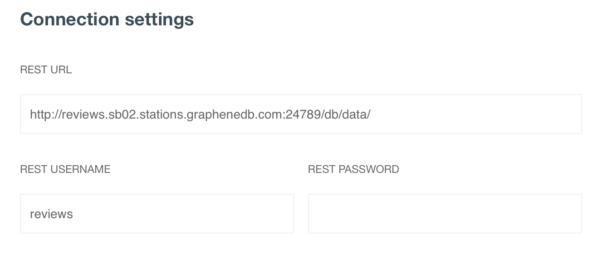
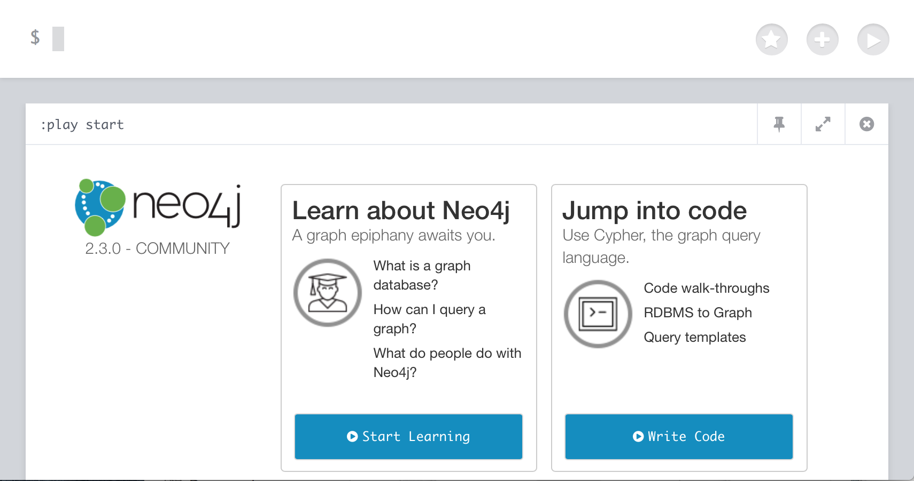
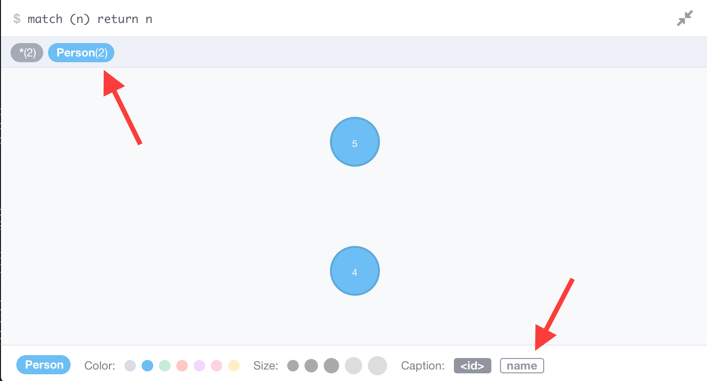
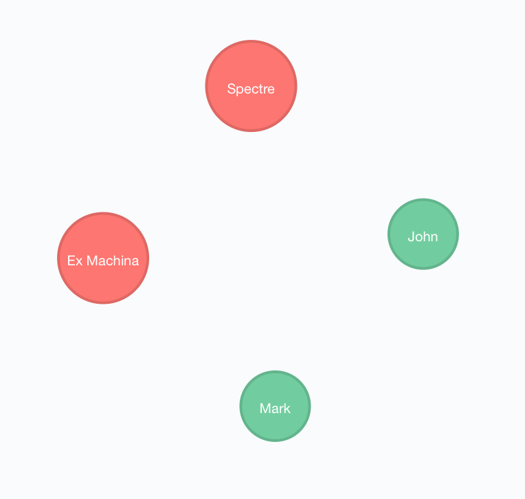

# Graph Databases

You have already worked with a _document database_ and understand the scenarios where it would be appropriate. In this worksheet you will be extending your understanding to a different type of _NoSQL_ database called a **graph database*.

We will be working with the [Neo4J](http://neo4j.com) platform which runs on the Java JRE. It is an _in-memory_ database which means we won't be able to run it on our Cloud 9 micro-server. Thankfully there are a number of dedicated hosted platforms where we can run it for free. In this worksheet we will use [GrapheneDB](https://app.graphenedb.com).

## 1 Creating the Database

Start by creating an account at https://app.graphenedb.com and logging in. Next click on the button to create a new database.



Choose the **Hobby - Sandbox** option, it has enough capacity for our experiments. Choose the latest community edition (2.3.0 at the time of writing) and name your database **reviews**. Then click **Create Database**.

### 1.1 REST Credentials

You should see the REST credentials on the next screen. These will look somewhat like this:



Open a web browser and paste in the supplied URL, leaving off the file path. For example `reviews.sb02.stations.graphenedb.com:24789`, this will bring up the _database browser_ where we will practice our **cypher queries**. We use the cypher query language to manipulate the database.



We will use the database browser to run our queries in the next section.

## 2 Learning Cypher

Its time to dive in and build a dataset using the _cypher_ query language. In this example we are building a review database containing users and films. A graph database contains two types of object, nodes and relationships that describe how nodes are linked.

### 2.1 Adding Nodes

Lets start by adding a **PERSON** node. Nodes have a _type_ and can have any number of keys and values.
```
CREATE (n:Person { name : 'Mark' })
CREATE (n:Person { name : 'John' })
```
This creates two **PERSON** nodes and assigns a **name** property to each. The database browser has a history accessible by using the up arrow. You can also click anywhere in a query to position the cursor. To see a visualisation of the current graph.
```
match (n) return n
```


Each _type_ of node appears in a different colour. At the moment we have only added _PERSON_ nodes. Click on the _node type selector_ as shown in the screenshot. This will reveal the _node type settings_ at the bottom of the screen. Each node has a unique id and this is displayed in the node circles. Click on the _name_ field as shown to substitute the node names. You can also customise the node size and colour. Spend a few moments getting familiar with the options.

Now we can add some **FILM** nodes.
```
CREATE (n:FILM { title : 'Spectre' })
CREATE (n:FILM { title : 'Ex Machina' })
match (n) return n
```


If at any time you want to reset the database this query will delete all nodes and their queries.
```
MATCH (n) OPTIONAL MATCH (n)-[r]-() DELETE n,r
```

### 2.2 Adding Relationships

Now we have some nodes, its time to add some relationships. Our relationships will represent _film reviews_ and include a rating out of 5. This should all be on a _single line_.
```
MATCH (a:PERSON), (b:FILM) 
WHERE a.name = 'John' AND b.title = 'Spectre' 
CREATE (a)-[c:REVIEW { rating : 4 }]->(b) 
RETURN c
```
Lets take a moment to understand the syntax.
1. the first part identifies the **a** placeholder with a _PERSON_ node and the **b** with a _FILM_ node.
2. next, we apply filters to each placeholder to identify which node(s) we want.
3. Then we define the relationship, notice that the relationship is in the square braces and that it has a direction.
4. finally we need to return the relationship, this will also return any nodes it connects.


## Sample Data Sets

http://neo4j.com/developer/example-data/

converting RESTful API data to graph

https://linkurio.us/crunchbase-graph-importing-data-neo4j/

Perhaps generating a graph from the **Open Movie Database (OBDb)**

http://www.omdbapi.com

Uses OMDb IDs as uniques.


## Presentation

https://goo.gl/0xgdu6
