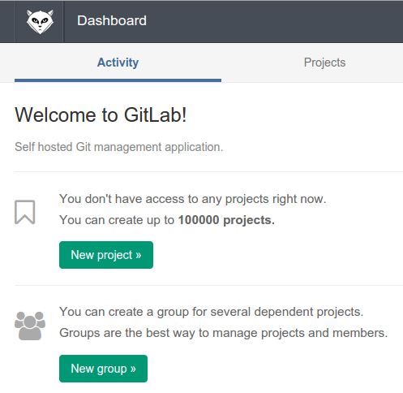
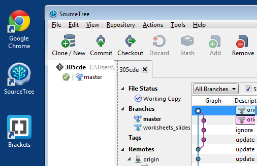
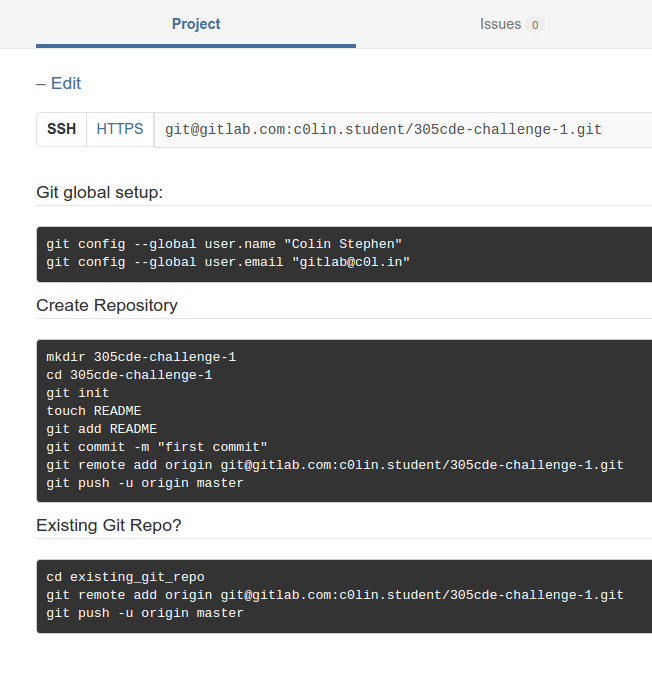
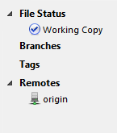
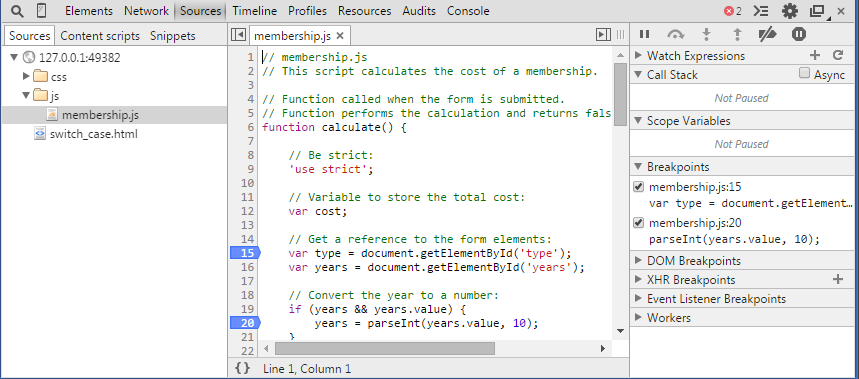
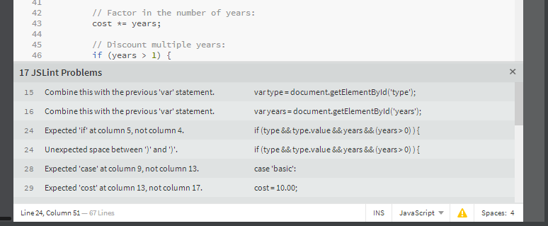

# About

This week is mainly about getting started with JavaScript development. It will also cover some of the absolute basics of the language.

# Task List

Aim for around 5 minutes per task.

1. Register for a user account on GitLab
2. Use Atlassian SourceTree to clone the 305CDE repository to your local machine / network drive
3. Create a new repository for your solution to the first weekly challenge
4. Test it works: modify, add, commit, push
5. Get the first JS example running in your browser and try to understand the code
6. Use the Chrome browser developer tools to fix any bugs introduced in the second JS example
7. Use the Brackets JSLint feedback to improve the code in the third JS example 

# Resources

[305CDE Repository][]

### Tutorials

* [Mozilla JS tutorial][]: _A FANTASTIC, comprehensive, concise resource for learning JS quickly._
* [Simple guide to git][]
* [Become a git guru][]
* [How to use Chrome Developer Tools][Dev Tools]
* [Debugging JavaScript][Debugging]

### Web Services

* [GitLab][]

### Downloads

* [SourceTree][]
* [Git for Linux][]
* [Git GUI clients][Git with GUI]
* [Brackets web development editor][Brackets]

[305CDE Repository]: https://gitlab.com/c0lin/305cde
[GitLab]: https://gitlab.com
[GitHub]: https://github.com
[Simple guide to git]: http://rogerdudler.github.io/git-guide/
[Become a git guru]: https://www.atlassian.com/git/tutorials/
[SourceTree]: http://www.sourcetreeapp.com/
[Git for Linux]: http://git-scm.com/download/linux
[Git with GUI]: http://git-scm.com/downloads/guis
[Brackets]: http://brackets.io/?lang=en
[Mozilla JS tutorial]: https://developer.mozilla.org/en-US/docs/Web/JavaScript/A_re-introduction_to_JavaScript
[Dev Tools]: https://developer.chrome.com/devtools
[Debugging]: https://developer.chrome.com/devtools/docs/javascript-debugging

# Step-by-Step

## 1. Register for a user account on Gitlab

You will be using git version control for all of your code on this module. Register for a free account at [GitLab][]. This is an open source alternative to the more popular [GitHub][] which allows unlimited private repositories. Both of these are web front-ends for git repository management systems.

If you have never used git version control before, then read the quickstart [simple guide to git][]. You can then [become a git guru][] in your own time between labs.

## 2. Use SourceTree to clone the 305CDE repository

Once you confirm your GitLab registration, you will be able to clone the 305CDE repository containing the materials for this module.

There are many git clients to choose from, and we will be using the Atlassian [SourceTree][] application in labs (Windows or OSX). If you are using Linux on your own computer, there are several ways to install a [command line client][git for linux] or a [gui client][git with gui].

### Cloning the repository

If/when you are asked for a username/password, use your GitLab credentials.

- In SourceTree click on 'Clone/New'.
- In the URL field enter `https://gitlab.com/c0lin/305cde.git`.
- Change the destination path to a folder you will have access to later (such as a network drive).
	* The folder must be empty.
- Leave the bookmark box ticked.
- Click 'Clone'.

You now have local copies of all the materials for 305CDE labs available so far, including this worksheet. You will be able to pull any additions or changes made in future to update the files you just created.

## 3. Create a new repository for *Challenge 1*

There are two ways to start new repositories, depending on whether you already have local files to commit or not. If you are starting from scratch, then you can just create a new project in GitLab and clone it to a local folder, as in the last task. If you already have files to commit you can initialise your repository locally and push it to an empty remote project.

Either way, you need to create a new project on GitLab.

- On the GitLab dashboard screen, click "New project" or "Add project"
- Give your project a reasonable name such as "305CDE Challenge 1"
- Once created you will be presented with the project dashboard containing the repository URL

Next you will need to clone the repo locally, if you are starting the project from scratch, or initialise a repo locally and push it to the one on GitLab you just created. We will step through the latter scenario, since it is more common to have some files you want to commit already.

- Create a new folder `challenge1` somewhere and add a test `test.md` file to it with some text
- In SourceTree click on 'Clone/New'
- Change to the 'Create new repository' tab
- Browse to the `challenge1` folder (the new root of your repository/project)
- Click 'Create' to set up the repo locally

Next you wish to push the local files up to your remote (empty) project on GitLab, but SourceTree does not know about this remote project yet. Add the remote repo to the local one you just set up:

- In SourceTree click on 'Settings' at the top right
- In the 'Remotes' tab click 'Add'
- Tick the 'Default remote' box
- Paste the URL to your empty GitLab repository (don't forget the `.git` at the end)
- Click 'OK' to add the new origin to your list of remotes 

- Click on 'Add/Remove' to stage all of the files in your local repo
- Add a commit message at the bottom of the screen and click 'Commit'
	* If you get an error you may need to specify an email address, since commits require valid emails to be associated with users
	* Go to 'Settings > Advanced', untick 'Use global user settings' and add your name and an email address
	* Committing should now work
- Next click 'Push' to send the commit to your GitLab project
- You want to push to repository 'origin' at the URL of your project
- Tick the 'master' branch tickbox then click 'OK'

Your local repository should now be pushed up to the web. Refresh the GitLab project page to check that it worked.

## 4. Test versioning for *Challenge 1*

Play around with changing the content of your test file, adding new files and folders to the root of your repository, staging, committing, and pushing the changes.

In particular ensure you become happy with the following principles of version control for future weeks, in rough order of importance:

1. Add, Remove, and Add/Remove
2. Commit
3. Push
4. Checkout
5. Pull
6. Stash
7. Discard

It is hard to completely mess up and lose work in a git repository as it remembers everything you ever commit including deleted files. This works in your favour if you follow the mantra "commit early, and commit often".

## 5. Live Preview

**NOTE:** If you wish to save your changes to code locally, ensure you do so on a newtork or removable drive, NOT on the C:\ drive of the lab machines.

### Reference

Lots of the JavaScript you will encounter in this part of the course is nicely summarised on the Mozilla Developer Network [JS Tutorial][Mozilla JS Tutorial].

### Task

Fire up a suitable code editor and use it to explore the first example code files for this lab.

* Load [Brackets][] or an editor of your choice (we strongly recommend Brackets)
* Select 'File > Open Folder...' and browse to the `labs/week1/code` subfolder to open it and display the files in the editor

The first example is called `basic_math.html` and it uses the external JavaScript file at relative path `js/shopping.js`.

Try the Brackets editor 'Live Preview' functionality as follows:

* Load up `basic_math.html` in the editor and you will see a very simple HTML form
* To the right hand side of the editor is a lightning bolt icon, click it to open a live preview of the page

* The page uses `js/shopping.js` so load that up next to take a look at the code

You will see a simple JavaScript function that interacts with the form and does a calculation to determine the bulk price to display.

* Read through the code comments to understand what each part of the JavaScript code is doing.

### Test your understanding

1. modify the JS code to double the discount applied when the quantity ordered is greater than 100 items
2. modify the HTML form to include a shipping field, and include this value in the total calculation in `shopping.js`

## 6. Chrome Developer Tools

To follow this example, you will use the [Chrome Developer Tools][Dev Tools].

### Console output

* Load up `conditionals_booleans.html` and go to the live preview
* Enter some valid inputs into the form and submit it

"Nothing" happens... Actually, the result is being logged to the console which is a part of the Chrome Developer Tools integrated in to the browser.

* Hit F12 in Chrome to load the developer tools
* Click on the console tab and try submitting the form again (you can ignore errors at this point) to see output
* Go back to Brackets and load `contact.js` to see where this output comes from

### Test your understanding

1. modify the HTML form to include a "Full Name" field
2. add validation in `contact.js` to ensure that the name entered has at least two parts separated by a space, and is between 3 and 100 characters in length

### Basic debugging

For a much more detailed description read Google's [debugging JavaScript][Debugging] guide.

Sometimes your attempts to change the code will introduce bugs. A bug is usually signalled by some kind of error message, usually RED in colour, appearing on the console. If you find a bug has appeared in your code do the following to help track it down:

* Note the line number that caused the problem, if any is mentioned on the console output (sometimes it is not)
* Load the 'Sources' tab in the developer tools area and select the JS file
* Click in the margin next to any line number to add a code break (add it near but before the suspect line); you can add several if you wish
* Now refresh the page and proceed as normal until the code execution stops at the line break you created
* On the information tab on the right hand side you will see details about the call stack and currently scoped variables to help you pinpoint the state of your program
* Use the "Step over / into / out of" buttons to execute your JS line by line and keep an eye on the stack and scope to catch anything unexpected

If your code is always perfect(!) then please introduce an intentional syntax error in `contact.js` to practice the procedure above.

## 7. JSLint Code Checking

Writing clean, readable, and error-free high-quality code is essential to maintainability. Therefore most languages now have automated syntax and style "checkers" called [linters](http://en.wikipedia.org/wiki/Lint_(software)) that code editors and IDEs can use to alert potential problems to programmers immediately, when they are writing their code.

One such linter for JavaScript is called [JSLint](http://www.jslint.com/lint.html), and it is built in to the Brackets editor to help you improve any code you work with.

* Load up `switch_case.html` in Brackets
* Click the yellow exclamation symbol at the bottom right of the editor
* This loads up any warning issued by the linter
* Click any warning to go to the appropriate line and correct it

Note that many of the highlighted issues are about things like indentation, and consistency of style, as well as syntax. That is because linters take readable code very seriously, and so should you! You should aim to have no JSLint warnings when you write your JavaScript or other programming code.

* Go to the live preview of the `switch_case.html` file to see what it does
* Load the `js/membership.js` file and follow the code to determine how it works

### Test your understanding

Once you have corrected for any JSLint errors found by the code linter, do the following.

1. Add a payment method field to the form with options for "Debit Card, Credit Card, Cash, Gold Bullion"
2. Add additional switch-case processing in the JavaScript to apply a 2% charge for Credit Card, and a 5% discount for Gold Bullion
