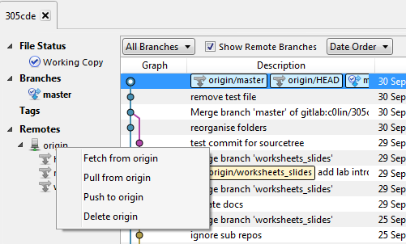
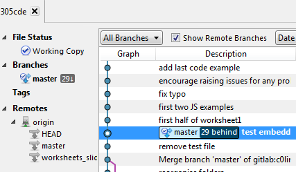
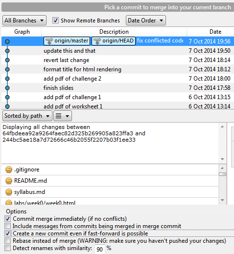
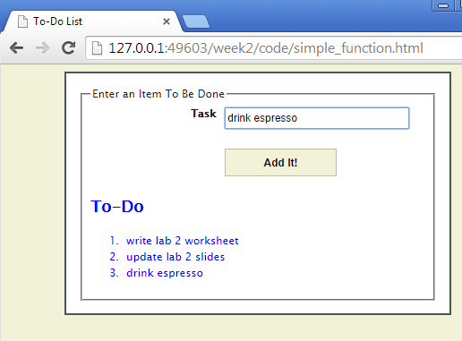

# About

This week introduces the two key data types in JS: objects and functions. Get used to their basic syntax and common use cases.

# Task List

Aim to complete these in roughly 30-60 minutes of lab time. Use SourceTree git client and Brackets editor, _or other equivalent software that you are familiar with_.

1. Update your local repository by pulling any changes from GitLab.
2. Write a simple function to remove duplicates from a task list.
3. Nest objects to define the internal sub-components of a car and engine.
4. Use an inner "helper function" to calculate fuel consumption.

# Resources

* [305CDE Repository][]
* [Mozilla JS tutorial][]: _A FANTASTIC, comprehensive, concise resource for learning JS quickly._

[305CDE Repository]: https://gitlab.com/c0lin/305cde
[Mozilla JS tutorial]: https://developer.mozilla.org/en-US/docs/Web/JavaScript/A_re-introduction_to_JavaScript

# Step-by-Step

## 1. Pull From GitLab

It is good practice to check for any changes to repositories you work with, whenever you start a new work session. If changes exist, `git fetch` or `git pull` them so that you can work with them locally.

* `git fetch` brings down any changes in the remote repository, but does NOT merge them with your local code. They remain in git until you explicitly `git merge` them with your own code.
* `git pull` does a fetch then also attempts to merge any changes with your local code automatically. If any conflicts arise, you are notified.

Here we show a fetch and merge. Pull is quicker.

* Open SourceTree and right click the origin of your repository. Choose "Fetch from origin".

* Enter your GitLab password if requested.
* If there were any new changes, made by remote users, then your local files will be "behind" the origin as shown in the next screenshot.

You can look at any of the changes by scanning the newer commits. Typically you will wish to simply merge them in to your current files.

* Click on "Merge" and choose the commit you wish to merge in to your current branch. Typically this will be the most recent one, at the top of the list.
* **Advanced:** Optionally tick the box "Create a new commit even if fast-forward is available". This makes a separate entry in the git history log, explicitly capturing the application of your merge.
	- This can be a good practice to get in to.
	- It can make recovering from mistakes when merging easier.
	- However you will have to push the additional commit back to origin, so you may not wish to do it when working with a single branch.

* Choose how to fix any code conflicts that arise (hopefully none!).

Your local code is now up to date with the remote origin.

## 2. Task List Manipulation

In this task you will write a simple function to detect and remove duplicates from a task list.

* Open the `simple_function.html` from `labs/week2/code/` in Brackets.
* View the live preview and test out what the page does.

* Load the associated JS file `js/tasks.js` in Brackets and check you understand how it works.

### Test Your Understanding

1. Add a button to the html page labelled "Remove duplicates".
2. When clicked, this button should trigger a new function `removeDuplicates()` against the `tasks` list.
3. The removal function should parse the list and remove any identical copies of previous items (leaving at most one).

## 3. Nested Sub-Object Assignment

In this task you will extend an existing JS object by nesting further object(s).

* Open the `function_returns_object.html` file in Brackets.
* View the live preview and hit F12 to view the developer tools JS console. **NOTE:** all output from the JS appears on the console.
* Refresh the browser to see alternative outputs.
* Review the JS in the html file and ensure you understand how it works.

### Test Your Understanding

1. Add a `makeEngine()` function that constructs and returns random engine objects. Engines might be characterised by:
	* Cylinders
	* CC Volume
	* Fuel type (diesel, petrol, etc.)
	* Max torque
2. Use the new function inside the `makeCar()` function, to make an engine and add it to the car object returned by `makeCar()`.
3. Ensure you include the engine details in the console log to show that it works.

## 4. Nested Helper Functions

In this task you will modify an existing method of an object and "factor out" some of its code in to a separate internal "helper function" which does an intermediary calculation.

* Open the `object_methods.html` file in Brackets.
* View the live preview and hit F12 to view the developer tools JS console. **NOTE:** all output from the JS appears on the console.
* Review the JS in the html file and ensure you understand how it works.

### Test Your Understanding

1. Add an empty internal `updateFuel()` function within the `drive` method of the `fiat` object.
2. Add code to the new helper function which updates the fuel by decrementing the fiat's fuel by 1.
3. In the original `drive()` method, instead of the assignment `this.fuel = this.fuel - 1`, invoke your new function.
4. Refresh the page and ensure that the console output is _exactly the same as before_.
5. Also test it by adding an appropriate code break in the "Sources" tab of your file in Chrome developer tools, and watch the value of `fiat.fuel` change as you step through the calls to the `fiat.drive()` method.
