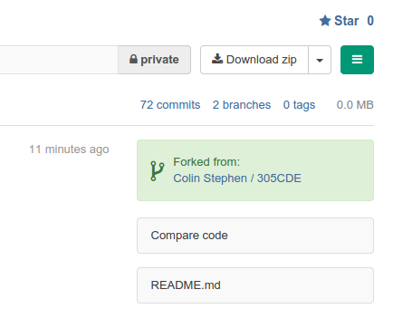
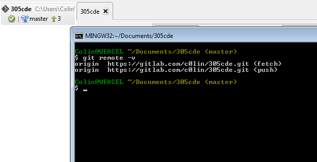

# About

This week covers more advanced uses of objects and functions in JS.

Objects and functions are extremely powerful. This week explores some of the more advanced ways you can use both of them.

# Task List

Aim to complete these in roughly 60-80 minutes of lab time. Use SourceTree git client and Brackets editor, _or other equivalent software that you are familiar with_.

1. Set up a secondary remote repository to store your worksheet solutions.
2. Write a closure to maintain the internal state of a counter.
3. Define a constructor function and modify its prototype.

(For the adventurous!)

4. Create a new JS module.

# Resources

* [Working with remote git repositories][]
* [MDN guide to JS closures][]
* [JavaScript module discussion][]
* [Object Oriented JavaScript][]
* [JS module pattern][]
* [Immediately-Invoked function expressions][]

[Working with remote git repositories]: http://git-scm.com/book/en/Git-Basics-Working-with-Remotes
[MDN guide to JS closures]: https://developer.mozilla.org/en-US/docs/Web/JavaScript/Guide/Closures
[JavaScript module discussion]: http://www.adequatelygood.com/JavaScript-Module-Pattern-In-Depth.html
[Object Oriented JavaScript]: https://developer.mozilla.org/en-US/docs/Web/JavaScript/Introduction_to_Object-Oriented_JavaScript
[JS module pattern]: http://www.adequatelygood.com/JavaScript-Module-Pattern-In-Depth.html
[Immediately-Invoked function expressions]: http://benalman.com/news/2010/11/immediately-invoked-function-expression/

# Step-by-Step

## 1. Set up a second remote repository

### Motivation

Now that the code you are writing in lab sessions is more complex, you may wish to keep track of your solutions to the tasks.

Currently you are pulling changes from the remote origin on GitLab, containing the files for 305CDE. However, this repository is _read only_ and you cannot push any changes to the repository.

To enable you to work on the repository, keep it up to date, AND keep track of your versioned changes you need another read-write remote repository that you can push your changes to.

In this task you will use the _git shell/terminal_ to achieve this.

### Fork the 305CDE repo

`Forking` allows you to copy an entire repository to your own account.

* Log in to your GitLab account
* Browse to the [305CDE repository]()
* On the top right of the project screen click "Fork"
* Load your GitLab dashboard and you will see `305CDE` in your list of projects
* View the project page and note that it shows the original repo you forked from, as shown in the screenshot.

* If you wish to keep your new copy private, view settings and set the "Visibility Level" to _Private_. 
* Copy the project `https://` URL listed on the project page for the next steps.

### Using the git shell

Next you will configure your git client to push any changes to your fork of the repository

* First select the git repo you are working on in the left hand column of SourceTree, if you have more than one  
* Click on 'Terminal' in the toolbar of SourceTree to load a git shell
	* The terminal provides a text-input interface to git
	* All changes you do are reflected in the GUI later
	* It is much faster to use than the GUI
	* It will become easier to understand and use than the GUI too
* For information, list the current remote origin by typing `git remote -v` in the terminal
	* You will see the 305CDE repo origin listed for pushing and pulling, as shown in the screenshot.

* To add a new remote corresponding to your fork of the project
	* `git remote add myfork https://your-https-url-for-the-fork`
* Check that it was added correctly with `git remote -v` again
	* This should now show a push and pull URL for `origin` and also for `myfork`

Now you can push any changes you make in labs to your remote `myfork`. The GUI gives you an option to choose which remote to push or pull from. In the terminal, you can push to the fork with the command `git push myfork`. 

NOTE: A simple `git push` will default to origin, which will fail. See [Working with remote git repositories][] for much more detail on working effectively with multiple remotes.

## 2. Use closure to maintain internal state

[MDN guide to JS closures][]

* Load the `function_closure.html` file in Brackets and take a look at the functionality using live preview
* Observe that the `button.onclick` event handler is a function that uses the `count` variable
* Observe also that this function does not specify any value for `count`
* Instead, `count` inside the handler function is given its value _by the enclosing function context_

Since the `window.onload` handler function encloses the `button.onclick` one, the latter has an "environment" of local variables that it can work with. The `onclick` function is therefore able to keep track of the state of a higher-level variable, namely `count`.

This technique adds a lot of power to the language. For example, as we see here, state can be maintained in "private" scoped variables, even after the enclosing function has returned.

### Test your understanding

* Add three buttons to the `function_closure.html` page: '-', '0', '+'
	* You can think of these as the playback speed controls for a media player
* Add a `
` with ID `playback-speed` to the page as well
* Using the existing `onload` handler as an example, write another `window.onload` handler:
	* This one should have an internal state representing the current playback speed
	* Clicking on one of the '+' or '-' buttons should increment or decrement the current speed as appropriate
	* Clicking on the '0' button should reset the current speed to 0
	* The current speed should be displayed in the `
` you added

If you have time, use a single helper function to update the `
` rather than update it in each separate click handler.

## 3. Use functions to construct objects and modify their prototype

[Object Oriented JavaScript][]

* Load the `js_classes.html` file and view it in a browser using Brackets live preview (or otherwise)
* Hit F12 in the browser, since all output is on the console
* Note the creation of three "coffee objects" in the JS code, using the `new` keyword and a constructor function called `Coffee`

* Now open `extending_js_types.html` to see the use of JavaScript's inheritance mechanism: the prototype
* Live preview the page and note the console output.
* Note that the `prototype` object of the built-in `String` JS data type has allowed us to "extend" the functionality of strings by adding a new string method called `palindrome`.

Prototype inheritance applies to any JS data type / object, including objects created as instances of constructor functions like `Coffee()`. The prototype of an object can be modified or overridden by JS code at runtime. Any other object sharing this prototype is also modified in the same way.

### Test your understanding

* First, add a `Tea(type, ounces)` constructor function to the `js_classes.html` JavaScript.
	* Add properties for `type` and `ounces`
	* Add methods: `getSteepTime()` and `order()`, and use appropriate code within them
* Now create some new `Tea` instance objects and invoke the `order()` method to check that it works

* Once it is working, extend the `Tea` and `Coffee` prototypes by giving both a new method `sip()`
	* Each invocation of `sip()` should simply log "Hmm, tasty" to the console

## 4. Create a JavaScript module (N.B.: advanced)

See [JS module pattern][] along with [Immediately-Invoked function expressions][] for a good discussion of what follows.

This is more advanced but begins to show the power of JS as a fully fledged language for designing and building large-scale applications. In particular, function closures and immediate invocation allows us to define self-contained modules that do not pollute the global namespace. This is how libraries such as, for example, jQuery and YUI, are put together.

* Load the `advanced_obj_fun` folder in Brackets and preview `index.html`.
* Play with the app, it is a simple task list. However, it is implemented as a proper application, using modules.

Load the following files in the editor:

- advanced_obj_fun/
	* js/
		- model.js
		- store.js
		- app.js
	* index.html

Together these JS modules implement the "model" part of MVC (Model View Controller).

* Look at the JS files and note some of their similarities:
	- Each one defines an "immediately invoked function"
	- Each one contains a constructor function at the top
	- `store.js` and `model.js` both extend their constructor prototypes
	- `store.js` and `model.js` both export their constructor to a global namespace at the end

These things are all typical of the "module pattern" in JS. For more on it, see the website linked to above.

### Test your understanding

* Write a short module that exports a utility object called "$" to the global namespace.
* This object should reimplement the JS `document.getElementById()` selector method using its own method `$.id()`.

In other words, any page that includes your new module JS file should be able to call `$.id("myButton")` and this will return a reference to the DOM element with ID "myButton" (if any).

By doing this you should start to see how libraries such as jQuery add to or simplify the standard functionality of core JavaScript!
